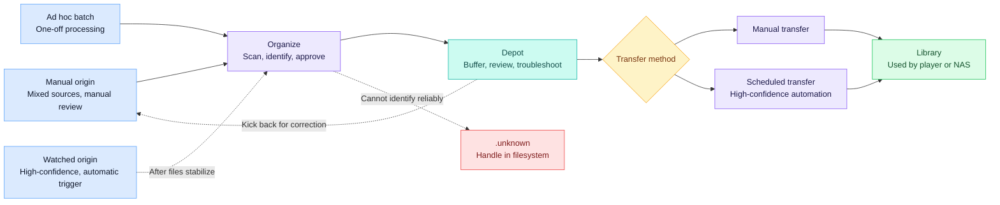
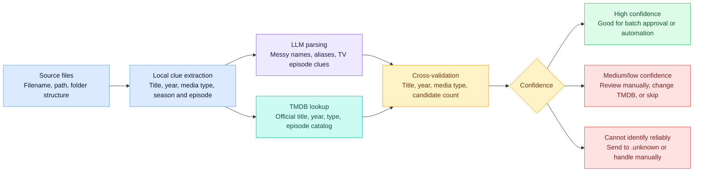
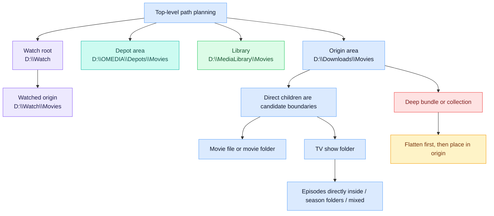
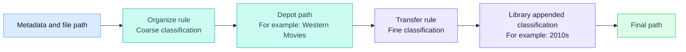

# OMEDIA User Guide

OMEDIA is a tool for organizing local media files and transferring them into media libraries. It separates **"where files come from"**, **"where they are reviewed first"**, and **"which media library they finally enter"** into configurable, traceable steps. It is designed for NAS setups, home servers, and long-running media management environments.

## Core Concepts and Workflow

OMEDIA's core workflow is: **identify media from an origin directory -> review it in a depot buffer -> use it from the final media library**. Manual origins, ad hoc batch origins, and watched origins all eventually **flow into depots**, then continue through the same transfer entry point.

- **Origin**: The intake location for files waiting to be organized. Only movie or TV files that are ready to scan should be placed here. Origins can be used for manual organization, as high-confidence automatic sources under a watch root, or as one-off ad hoc sources in "Organize".
- **Depot**: The aggregation point and buffer after organization. Use it for manual review, return, troubleshooting, or waiting for scheduled transfer. A depot should correspond to one clear library destination and one transfer strategy.
- **Library**: The final location read by players, media servers, or archival tools.
- **Rule**: Decides classification paths. Organize rules handle coarse classification before files enter a depot; transfer rules append finer classification before files enter the media library.
- **Category**: A matching branch inside a rule. All conditions inside the same category must be true. Within the same rule, categories are matched from top to bottom and stop at the first hit.
- **Watch**: An automatic organize entry point for high-confidence sources. It continuously observes direct child folders under a watch root, then scans, identifies, and organizes new files after they become stable.
- **Scheduled Transfer**: An automatic transfer task for high-confidence depots. It moves transferable files from a depot into the media library on a schedule.
- **Return**: Moves unsuitable candidates from a depot back to a specified origin or rework directory so they can be organized again later.
- **`.unknown`**: A reserved directory for files that automatic workflows cannot identify reliably. It is not an independent origin. Do not manually configure it as an origin, depot, library, or watch path.
- **Activity**: Records organization, transfer, return, skipped items, and failures for traceability.



**A depot is not an unnecessary detour; it is a controlled buffer.** It is also the convergence point for different organize entry points: manual organization, ad hoc batch organization, and watched automatic organization can all land in a depot first, then be reviewed and transferred through one consistent flow.

**When sources are mixed**, you can perform a second manual review in the depot. **When sources are stable**, it is still recommended to use a separate short-lived depot, then move files quickly into the library through manual batch transfer or scheduled transfer. Do not configure the depot path directly as the library path. Overlapping paths make scans, returns, and scheduled tasks unpredictable.

**Watch and scheduled transfer are intended for high-confidence sources.** Examples include download directories with stable naming, clear media types, and already-validated rules. When only watch is enabled, OMEDIA automatically organizes new files into a depot. When scheduled transfer is added, you can build a fully automatic flow: **"discover new files -> identify and organize automatically -> buffer in a depot -> transfer on schedule"**.

**Common ways to use OMEDIA:**

| Pattern | Entry point | Depot plan | Transfer rhythm | Good fit |
| --- | --- | --- | --- | --- |
| Mixed sources | Manual origin, such as `D:\Downloads\Movies` | Review depot, such as `D:\OMEDIA\Depots\Movies` | Manual transfer after human review | Unstable naming, complex sources, needs second confirmation |
| Stable sources | Watched origin, such as `D:\Watch\TV` | Short-lived depot, such as `D:\OMEDIA\ShortDepot\TV` | Scheduled transfer to `D:\MediaLibrary\TV` | Reliable source; watch and scheduled transfer can form a fully automatic flow |
| Ad hoc batch | Ad hoc source in "Organize" | Use an existing depot, or prepare a dedicated depot for this kind of batch | Manual transfer after batch confirmation | Occasional file batches that should not become long-term fixed origins |

The UI follows the same workflow. The sidebar keeps the main work surfaces under **Dashboard**, **Organize**, **Transfer**, and **Services**; **Activity** and **Settings** sit below them for audit and configuration. The Help button opens this guide, and the language switcher changes both the interface and the guide language.

## Media Identification and Confidence

OMEDIA's identification mechanism is not simple filename-based moving, and it does not blindly trust a single model's guess. It puts **clues from the files themselves**, **LLM understanding of complex naming**, and **authoritative TMDB metadata** into one validation flow, then exposes risk through confidence levels to minimize the chance of misidentified media entering the library.



- **Local clues come first**: OMEDIA first extracts structured clues from filenames, parent folders, origin boundaries, media type, year, season/episode numbering, and explicit `tmdb` markers instead of handing raw filenames directly to rules or automatic moves.
- **The LLM produces verifiable title hints**: When an LLM is configured, it turns release-group naming, multilingual aliases, and missing or mixed TV episode clues into candidate titles and episode hints that can be checked. Automatic title search only uses Chinese / English title hints returned by the LLM; when there is no usable title hint, OMEDIA does not force a broad TMDB search from the raw filename just to produce a result.
- **TMDB provides authoritative secondary validation**: OMEDIA queries TMDB with candidate titles, years, media types, or explicit TMDB IDs, then checks official titles, release years, types, countries/regions, and TV episode metadata. An explicit TMDB ID bypasses title search and validates the specified item directly.
- **Candidates are not simply taken from the first result**: Automatic search evaluates TMDB page results candidate by candidate and lazily loads details only when needed. It stops when a high-confidence result appears on the first page; otherwise it continues across a bounded number of pages and keeps the strongest result plus its evidence.
- **Years narrow the search and reduce risk**: Movie years and safe TV show years can narrow candidate search. Season- or episode-scoped years are mostly used for later validation. Year mismatches are not silently ignored; they affect confidence and the evidence summary.
- **Confidence is the second verification gate**: Identification results carry high, medium, low, or no confidence, along with evidence summaries. High confidence usually means signals such as title, year, and candidate ambiguity agree, making the item suitable for batch approval or automation. Medium or low confidence means ambiguity remains and the result should be reviewed. No confidence means there is no reliable candidate.
- **Uncertain items are stopped before library entry**: During manual organization, you can inspect evidence, search TMDB manually, specify a TMDB ID / IMDb ID, skip, or reorganize. In watched automatic organization, files that cannot be identified reliably go to `.unknown`. After files enter a depot, they are reviewed again before transfer. OMEDIA's value is not just automation; it is automation paired with controlled verification.

## Paths and Constraints

For path planning, define top-level boundaries before writing rules. **A directory should preferably have only one responsibility**: origins receive files waiting to be organized, depots buffer files and carry transfer strategy, and libraries are only for final use. **Different library destinations, different transfer rules, and different automation trust levels should usually use separate depots**. Do not mix everything into one depot and rely on memory to tell it apart later.



**Recommended order:**

1. **Decide libraries first**: For example, `D:\MediaLibrary\Movies` and `D:\MediaLibrary\TV`.
2. **Decide origins next**: For example, `D:\Downloads\Movies` and `D:\Downloads\TV`.
3. **Create independent depots**: Create them by destination and transfer strategy, such as `D:\OMEDIA\Depots\Movies`. A high-confidence automatic flow can also use something like `D:\OMEDIA\ShortDepot\TV`.
4. **Write rules last**: Make sure path output lands inside those boundaries.

**Path isolation rules:**

- **Use absolute paths**: Origins, depots, libraries, and watch roots should all use absolute paths.
- **Avoid overlapping paths**: Origins, depots, and libraries should not use the same directory and should not be parent/child directories of one another.
- **Isolate multiple path sets too**: Multiple origins, depots, and libraries should also be isolated from one another.
- **Watched origins must be direct child folders**: A watch root can contain watched origins, but each watched origin must be a direct child folder of the watch root, such as `D:\Watch\Movies`.
- **Do not mix manual origins into the watch root**: Ordinary manual origins are not recommended under the watch root.
- **Preserve `.unknown`**: `.unknown` is mainly used to hold unmatched files from automatic workflows. Do not configure it as an origin, depot, library, or watch path.

**Origin scan boundaries:**

- **Movie direct files**: Direct video files are supported, such as `D:\Downloads\Movies\Dune.2021.mkv`.
- **Movie folders**: Direct movie folders are supported, such as `D:\Downloads\Movies\Dune (2021)\Dune.2021.mkv`.
- **TV direct files**: Episodes can be placed directly under a show directory, such as `D:\Downloads\TV\Example Show\S01E01.mkv`.
- **TV season folders**: Season folders are supported, such as `D:\Downloads\TV\Example Show\Season 1\S01E01.mkv`.
- **TV mixed layout**: Direct episodes and season folders can exist together.
- **Deep bundles are not supported**: Do not put multiple movies or TV packages inside an arbitrary deeper collection folder, such as `D:\Downloads\Movies\Movie Batch\Dune (2021)\...`. Flatten this kind of directory first, so each movie or show becomes a direct child under the origin root.

**Hard constraints and unsupported scenarios:**

- **Cross-disk / cross-volume transfer is not supported**: OMEDIA's organization, return, and transfer flows are built around filesystem moves and rely on same-volume rename / replace semantics. It does not fall back to copy-across-disks behavior. Origins, depots, and libraries should live on the same disk, volume, or mount point. If you must cross disks, first move files into a same-volume workspace at the system level, then let OMEDIA handle them.
- **Do not use symlinks, junctions, or reparse points as working paths**: Origins, depots, libraries, watch roots, and candidate folders should be real directories. Link paths break boundary checks and safe delete / rename protections, so scans or file operations may be rejected.
- **Do not let working paths contain one another**: Origins, depots, libraries, watch roots, and `.unknown` must not overlap or be parent/child paths. Once paths overlap, scans, returns, conflict checks, and scheduled tasks become unpredictable.
- **Rule outputs must be relative path fragments**: Organize and transfer rules output classification fragments, not full paths. Do not output drive letters, absolute paths, `..`, `.`, empty fragments, or paths containing NUL. OMEDIA assembles the final path inside the origin / depot / library boundaries.
- **Scan scope is determined by extension settings**: Only extensions configured as video, subtitle, or sidecar participate in organize source scanning, subtitle detection, and source cleanup. Files that are not configured, or are excluded by the small-file threshold, do not become organize candidates.
- **Avoid concurrent operations on the same depot**: Organization, return, transfer, and candidate file operations all mutate the same disk files. Do not start multiple organize / transfer actions against the same depot at the same time. Wait for the existing task to finish or cancel it first.

## Organize and Transfer Review

1. **Create folder configuration**: In "Settings > Path planning", create depots first, then add manual origins under the depot they feed. Set the library path and TV full / incremental mode on the depot.
2. **Configure rules**: In "Settings > Rules", configure organize rules and transfer rules, then preview path output first.
3. **Scan sources**: In "Organize", select one or more manual origins, or switch to an ad hoc source path. Scanning creates source candidates, file inventory, and basic classifications; it does not move files.
4. **Identify and review**: Run identification for selected source candidates, then review confidence, evidence, planned paths, and overwrite conflicts. Search TMDB manually, accept, ignore, or rescan when needed.
5. **Organize into a depot**: Only accepted, executable plan items with resolved conflicts are moved into the depot.
6. **Review and transfer**: In "Transfer", select one or more depots and scan them. Transferable candidates are grouped by the current depot directory structure. If you find unsuitable candidates, you can return them to a specified origin or rework directory.
7. **Track results**: Organization, transfer, return, failures, and skipped items are written to "Activity" for later troubleshooting.

**Organize review flow:**

- **Scan phase**: The page shows source candidates and file inventory. Inspect directory structure, file classification, modified time, and obvious anomalies before deciding which candidates should enter identification.
- **Identify phase**: OMEDIA generates TMDB matches, media paths, subtitle / sidecar associations, and organize plans. High-confidence results are usually accepted by default, but you can still change them to ignored before running organization.
- **Manual review phase**: Medium confidence, low confidence, no confidence, existing targets, multiple sources pointing to the same package, episode warnings, and duplicate subtitle choices need attention. Manual TMDB search supports keywords, TMDB IDs, IMDb IDs, optional years, paged results, posters, and metadata so you can correct a candidate to the right item.
- **Execute phase**: OMEDIA only moves accepted plan items and writes results to Activity. Items that are not accepted, not executable, or still conflicted remain in the source until you rescan, fix, or handle them manually.

**Scan scope and file cleanup:**

- **Extension groups decide file roles**: Video extensions become media candidates; subtitle extensions participate in subtitle matching; sidecar extensions identify and clean up supporting files such as posters, nfo files, and text files.
- **The small-file threshold only affects non-subtitle files**: Non-subtitle files below the threshold do not enter organize candidates. Subtitle files are exempt. Setting the threshold to `0` disables small-file filtering.
- **Unsupported files are not organized as media**: Files not covered by extension settings are shown as unsupported or supporting information and do not generate media plans. Add new formats to extension settings before organizing them.
- **Source cleanup only happens during organization**: After the main candidate is organized successfully, associated subtitles and sidecars can move or be cleaned up with it. Transfer preserves files already present in depot candidates and does not rerun source extension cleanup.

**Source file operations:**

- **Rename / delete are real disk operations**: After scanning and before identification, you can rename or delete a source candidate or an individual source file. These actions change actual files inside the source directory, not just UI state.
- **Operations are confined to the source boundary**: Renames only change the name within the same parent directory, and delete / rename operations must stay under the current source root. Symlinks, reparse points, paths outside the source, and protected directories are rejected.
- **Rescan or identify again after changes**: File names, folder names, and file sets can change identification clues and planned paths. If you change source files in an already identified session, rescan before identifying again.
- **Conflict reviews lock related file operations**: If a candidate participates in an unresolved conflict review, resolve the package-level conflict action before file-level acceptance, rename, or delete operations.

**Overwrite and conflict handling:**

- **Movies are handled as complete media items**: Movie depots use the full package as the overwrite unit. When a target already exists, choose explicitly whether to replace it or keep the new one as a variant.
- **TV supports full and incremental modes**: Full mode uses the season package as the overwrite unit and fits complete season packs. Incremental mode syncs by episode key, replacing later files for the same episode while leaving other episodes in place, which fits ongoing shows.
- **Duplicate sources require a version choice first**: If multiple source candidates point to the same movie, season package, or episode, OMEDIA places them in a conflict review. Choose which version to keep, whether to replace the target, or apply a variant tag to one of them.
- **Existing targets are not silently overwritten**: When the depot or library already contains the target package, OMEDIA asks for an explicit decision. Unresolved conflict reviews do not enter organization execution.

**Bulk organization:**

- **You can scan multiple origins at once**: Selecting multiple origins in "Organize" creates one organize session per eligible origin and reports partial failures. Each session appears as its own card, so you can review them independently.
- **Depot content can flow back through organization**: If a depot candidate needs to be reidentified or reclassified, return it to an origin or rework directory, then organize it again as a manual source.
- **Active sessions limit duplicate starts**: When an origin already has an active organize session, finish, cancel, or rescan that session before starting another one. Only one ad hoc organize session can be active at a time.

**Transfer and depot review:**

- **Transfer starts from depots**: Select one or more predefined depots and scan them. The page opens one transfer card per depot and displays a candidate tree based on the current directory structure. Empty classification folders may appear, but only real media candidates can be transferred, returned, or inspected.
- **Transfer only accepted candidates**: Candidate switches define the transfer scope for that run. Ignored candidates remain in the depot, and blocked candidates cannot be selected until the underlying path or file issue is fixed.
- **Review depot candidates first**: Before transfer, inspect candidate details, file inventory, and target paths. If a candidate is wrong, rename, delete, or return the candidate or an individual file to an origin / rework directory.
- **Transfer jobs can be cancelled**: Running transfer jobs record status and keep their depot card visible. Cancelling does not roll back moves already completed; unprocessed candidates remain in the depot and can be scanned again later.
- **Activity is the source of truth for transfer results**: Success, skipped items, failures, and cancellations are written to Activity. If a target path or overwrite result is unexpected, check the corresponding Activity detail first.

**Choose the entry point based on source stability:**

- **Mixed sources**: Use manual origins. You scan and identify first, then confirm item by item, change TMDB matches, skip, or organize. Finally, review in the depot and transfer manually.
- **Stable sources**: Use watched origins. After new files stabilize, they are automatically organized into a short-lived depot, then scheduled transfer sends them into the media library.
- **Ad hoc batch**: Use the ad hoc source in "Organize". It is suitable for one-off file batches and does not require a long-term origin first. Organized results still enter the depot you choose.

If watch is enabled, **steps 3 through 5 can be triggered automatically by new files**. If scheduled transfer is configured, **steps 6 and 7 can run automatically on schedule**. When both are combined, high-confidence sources can complete identification, organization, and transfer without daily manual operation. It is recommended to run a small batch manually first, verify that paths and rules behave as expected, then enable automation.

## Rules and Paths

Understand rules in two layers: **organize rules decide "where to review first"**, and **transfer rules decide "which final classification layer to append"**. The two layers should not output the same classification segment repeatedly.

Rules are intentionally not split by movie or TV so they can be reused, and they are not bound to a media type. Media type comes from the origin, ad hoc organize entry, or depot. You can reuse the same rule for movies, TV, or multiple depots, but make sure the filter conditions are meaningful for the media type you apply them to. For example, TMDB genre, country/region, and release year metadata can behave differently for movies and TV. Preview a small set of samples before using a rule for bulk organization, watch automation, or scheduled transfer. Movie and TV names in this guide are examples, not separate rule modes.



**Final path order:**

```text
Library path / organize classification / transfer classification / media item path
```

**For example:**

```text
D:\MediaLibrary\Movies\Western Movies\2010s\Inception (2010) {tmdb-27205}\Inception.2010.2160p.mkv
```

Here, `Western Movies` comes from the coarse classification created during organization, `2010s` comes from the fine classification appended by the transfer rule, and the final segment is the media item path generated by OMEDIA from media information. **Transfer does not rerun organize rules and does not overwrite the depot's current path**. If you manually adjust directories inside a depot, transfer uses the current directory structure as the source of truth.

**Rule writing suggestions:**

- **Set a default category**: Every rule should have a default category, such as `Other Movies` or `Other TV`.
- **Place specific categories first**: Within the same rule, place specific, rare, or higher-risk categories before broad categories.
- **Use organize rules only for coarse routing**: For example, `Western Movies`, `Chinese Movies`, `US TV`, or `Japanese TV`.
- **Use transfer rules only for fine additions**: For example, `{decade}`, `{first_char}`, `Animation`, `Documentary`, or `4K`.
- **Do not generate organize categories again**: If an organize rule already outputs `Western Movies`, the transfer rule should not output `Western Movies\2010s`, or you may get `Western Movies\Western Movies\2010s\...`.
- **Preview before automating**: After writing rules, test previews with a small set of samples before enabling watch and scheduled transfer.

**Rule management conveniences:**

- **Copy a rule**: Use this when deriving a similar rule from an existing one, such as the same region routing with a different default category.
- **Import a template**: Import replaces the current draft's default category and categories while keeping the draft rule name. Check whether the current draft still needs to be kept before importing.
- **Check references before removing rules**: Origins, depots, watch settings, and scheduled transfer can reference rules. Before deleting or replacing a rule, confirm related configuration will not lose its routing basis.
- **Use variable references with live preview**: Variables generate dynamic categories, while preview validates sample paths. Using both helps catch duplicate classifications and illegal path fragments before bulk organization or automation.

**Common fields:**

- `relative_path`: The file path relative to the origin or depot. Transfer rules can see the full relative path inside the depot, so you can write `relative_path contains Western Movies`.
- `tmdb_release_year`: The release year of the movie or TV show.
- `tmdb_origin_country`: The country or region of origin returned by TMDB.
- `tmdb_genre_ids`: TMDB genre IDs.

**Common variables:**

- `{decade}`: Generates a category by decade, such as `2010s`.
- `{first_char}`: Generates a category by first letter, such as `A`, `B`, or `C`.

## Settings and Maintenance

The "Settings" page maintains OMEDIA's long-term configuration through four tabs: **Path planning**, **Rules**, **Providers**, and **Maintenance**. Treat it as the control panel for automation: configure depots, origins, and rules first, then providers, extensions, watch runtime settings, and finally backup and maintenance.

**Folders and health checks:**

- **Path planning is depot-first**: Create a depot for each destination strategy, then add the manual origins that feed it. This makes the origin -> depot -> library chain visible in one place.
- **Removing origins or depots only removes configuration, not disk files**: Media files remain on disk. Activity history keeps snapshots from the time of the operation, but may no longer link to current configuration.
- **Change depot paths carefully**: The depot path affects where future organization writes and transfer scans. The library path affects future transfer targets that have not started. Files in the old depot path are not migrated automatically.
- **Removal can be blocked by live use**: A depot used by origins, active organize sessions, or queued / running / cancelling transfer jobs must be reassigned, cancelled, or completed before it can be removed.
- **Use the server folder picker when possible**: Path fields can browse folders visible to the backend host. The selected path is still validated as a managed OMEDIA path before it is saved.
- **Health hints surface configuration gaps**: Dashboard and Settings show origin, depot, rule, watched origin, and scheduled transfer status. When you see broken origins, unlinked depots, or path warnings, fix configuration before running automation.

**Media identification providers:**

- **LLM provider**: Used for complex naming interpretation, title hints, and TV episode assistance. You can configure API key, base URL, model, batch size, rate limit, and HTTP proxy.
- **TMDB provider**: Used for movie and TV metadata lookup, manual search, and identification validation. You can configure API key, base URL, rate limit, and HTTP proxy.
- **Rate limits and proxies are stability settings**: If the network is unstable or a provider enforces rate limits, lower the rate limit or configure a proxy before increasing batch identification size.

**Organize settings:**

- **Extension settings**: Video, subtitle, and sidecar extension groups only affect organize source scanning, subtitle detection, and source cleanup. Transfer preserves files already present in depot candidates.
- **Small-file threshold**: Non-subtitle files smaller than the threshold do not enter organize candidates. `0` disables the threshold. This is useful for filtering samples, download leftovers, and meaningless tiny files.
- **Watch runtime settings**: Poll interval controls how often OMEDIA checks for new files. Stability debounce controls how long a file must remain unchanged before automatic organization starts. Slow download directories should use a longer stability wait.

**Maintenance actions:**

- **Clear TMDB cache**: Clears local TMDB metadata cache so later identification and search requests fetch fresh provider data.
- **Prune operation history**: Deletes older Activity events and terminal transfer records beyond the retention window. It does not delete configuration or disk media files.
- **Backup config**: Exports origins, depots, rules, provider settings, organize settings, watch runtime settings, and watch configuration. It does not include Activity history, Transfer history, caches, or disk media files.
- **Restore config**: Replaces current configuration from a backup and clears Activity history, Transfer history, and caches. Confirm the backup is trusted before restoring because provider API keys are restored with it.

## Watch and Scheduled Transfer

**Watch** is configured from "Services > Automatic Organization", with the watch root and timing values in the Services settings dialog. Its main purpose is to **serve high-confidence sources**: when a download directory has stable naming, a clear media type, and validated organize rules, OMEDIA can continuously observe that directory and **automatically scan, identify, and organize new files into the target depot**. You need to set a watch root first, then choose the media type, organize rule, and target depot for direct child folders under that root. After watch discovers new files, it waits for a stability period to avoid organizing files before copying or downloading has completed. **Files that still cannot be identified reliably by automatic identification enter `.unknown` under that source**, where they wait for you to handle them in the filesystem.

**Scheduled Transfer** is configured from "Services > Scheduled Transfer". Its goal is to take content that has already entered a depot and has sufficiently trustworthy rule results, then **send it into the media library on a schedule**. Each depot can use a daily, weekly, monthly, or supported five-field cron schedule, or it can remain manual-only. This is also why **one depot should correspond to one clear destination and one transfer strategy**. When the scheduled time arrives, OMEDIA scans the corresponding depot, moves transferable files into the library, and writes skipped items, failures, and completions to Activity.

**Watch plus scheduled transfer forms the full automation chain**: high-confidence sources keep entering the watch directory, OMEDIA automatically organizes them into a short-lived depot, and the scheduled task moves transferable results into the media library. It is recommended to stagger the two tasks. For example, let watch continuously organize into the depot during the day, then run scheduled transfer to the library overnight. For directories with chaotic naming, mixed sources, or unverified rules, **do not start with a fully automatic flow**. Organize manually and review by hand first.

**Watch notes:**

- **Watch only manages direct child folders under the watch root**: Each direct child folder can have a media type and target depot. Deeper folders do not automatically become independent origins.
- **Child folder rows are the watch configuration surface**: Unconfigured, configured, disabled, and missing child folders are shown together. Edit a row to set media type, target depot, and optional organize rule; removing the row configuration does not delete the disk folder.
- **Changing the watch root affects existing watched origins**: Changing the watch root usually stops current watch, clears pending events, and removes child origin configuration under the old root. Confirm no files are waiting for stability or currently organizing before changing it.
- **Stability waiting is not an identification delay**: It prevents organization from starting before copying, downloading, or unpacking has completed. Large files or network drives should use a longer stability wait.
- **`.unknown` is the automatic-flow holding area**: Files that cannot be identified reliably in a watched flow enter `.unknown` under that source and do not continue to automatic transfer. OMEDIA does not provide a retry action for this folder; after fixing the files, move them back to the source in the filesystem and organize again.

**Scheduled transfer notes:**

- **Only depots with a schedule transfer automatically**: Depots without a schedule remain manual-only.
- **Clearing a schedule returns the depot to manual-only**: Editing the scheduled transfer row changes the depot trigger. A saved empty schedule disables automatic transfer for that depot.
- **Cron support is intentionally bounded**: The UI covers daily, weekly, and monthly schedules directly. Advanced values must be five-field cron expressions using numbers, ranges, lists, `*`, or `*/step`.
- **Schedules should avoid organize peaks**: Stagger watch organization and scheduled transfer to reduce the chance that the same depot is modified at the same time.
- **Automatic transfer fits high-confidence depots**: If a depot often needs manual version choices, overwrite decisions, or path corrections, keep it manual until the workflow is stable.

## Troubleshooting and FAQ

Dashboard and Activity answer two questions: **whether configuration is healthy right now**, and **what just happened**. After automation starts running, these pages are usually better troubleshooting entry points than browsing folders directly.

**Dashboard:**

- **Configuration overview**: Check origin, depot, rule, watched folder, and scheduled transfer counts to confirm the basic chain is complete. Status badges show whether watch is running and whether transfer jobs are queued or active.
- **Pipeline overview**: Expand the pipeline table to verify origin -> depot -> library routing, organize / transfer rules, media type, and TV incremental mode.
- **Recent organize and transfer status**: Review moved, unmatched, skipped, failed, queued, and running work to decide whether rules, providers, or path planning need adjustment.

**Activity:**

- **Use quick filters first**: All, needs attention, unmatched, failed, organize, transfer, automation, and file operations narrow common investigations quickly.
- **Filter by time and advanced fields**: Use all time, today, this week, last 30 days, or advanced filters for area, action, status, reason, origin, depot, library path, media type, TMDB ID, and custom dates.
- **Inspect details and technical context**: Failure reasons, source paths, target paths, move status, confidence, and context are preserved in Activity details.
- **Use Activity as the audit source**: When disk state differs from expectations, check Activity first, then decide whether to retry, kick back, rescan, or handle manually.

**FAQ:**

### Can an origin and a depot be the same directory?

**It is not recommended, and it usually should not pass path validation.** An origin is the intake location waiting to be organized; a depot is the buffer after organization. Keeping them separate makes review, return, scheduled transfer, and troubleshooting much clearer.

### Why were my files not organized automatically?

Check whether **watch is running**, whether **the watch root is correct**, whether **the child folder has a media type and target depot configured**, and whether the file has passed the stability waiting period. You can also check failures or skipped records in "Activity".

### What is the difference between `.unknown` and return?

**`.unknown` mainly appears during watched automatic organization**: the file has entered a high-confidence watched source, but OMEDIA cannot identify it reliably, so it is placed in `.unknown` under that source to avoid continued automatic transfer. **Return happens in the depot**: if you find that a candidate is unsuitable before transfer, you can return it to a specified origin or rework directory, then organize it again as a manual origin later. Both are written to Activity for traceability.

### Why is the transfer target path not what I expected?

Usually you need to check three things: **the current coarse classification inside the depot**, **the category matched by the transfer rule**, and **the default category**. Use live preview in "Settings > Rules" to test sample paths and metadata, then confirm whether the final path matches your expectations.

### Why does the Transfer page show empty folders that cannot be selected or transferred?

Empty folders may only be **classification groups** inside the depot, with no actual media candidates yet. OMEDIA displays them, but does not treat them as transferable candidates and does not provide accept, return, or detail actions for them.

### What should I do when identification results are inaccurate?

Use **manual TMDB search** on the "Organize" page to replace the movie or TV match. For files whose TV episode information is unclear, check the file name, season/episode numbering, and LLM provider configuration.

### Will files be lost after transfer failure?

OMEDIA records the failure reason and tries to keep files in traceable locations. Check **the failure details in "Activity"** first, then decide whether to retry, kick back, or handle manually.

### Should I enable watch first or organize manually first?

It is recommended to **organize a small batch manually first** and confirm that origins, depots, libraries, and rules all behave as expected. After the workflow is stable, enable watch and scheduled transfer.
