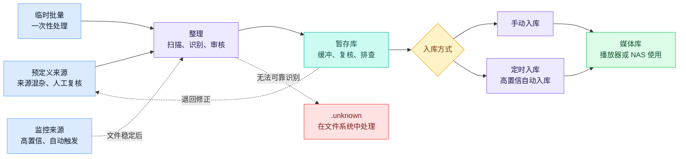
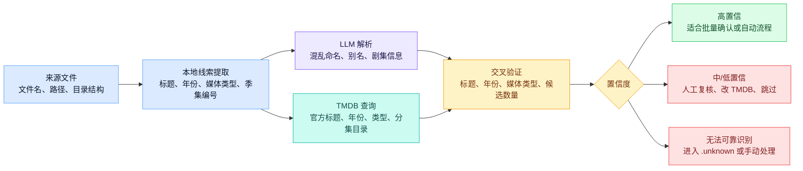
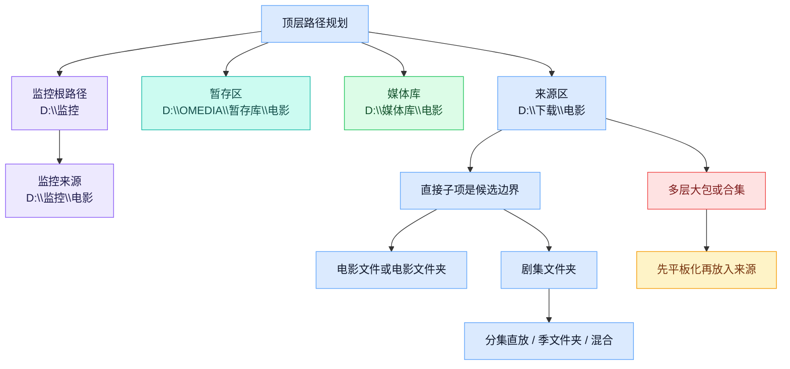

# OMEDIA 用户指南

OMEDIA 是一个面向本地媒体库的整理和入库工具。它把 **“从哪里来”**、**“先放到哪里复核”**、**“最后进入哪个媒体库”** 拆成可配置、可追踪的流程，适合运行在 NAS、家庭服务器或长期维护的媒体整理环境中。

## 核心概念与流程

OMEDIA 的核心流程是：**来源目录识别媒体 -> 暂存库复核缓冲 -> 媒体库最终使用**。预定义来源、临时来源和监控来源最后都会 **汇入暂存库**，之后在同一个入库入口继续处理。

- **来源**：待整理入口，只放准备扫描的电影或剧集文件。来源可以用于手动整理，也可以作为监控根路径下的高置信自动来源；临时批量文件也可以在“整理”中作为一次性来源处理。
- **暂存库**：整理后的汇聚点和缓冲区，用来人工二次检阅、退回、问题排查，或等待定时入库。一个暂存库应对应一个明确的媒体库目的地和一种入库策略。
- **媒体库**：最终给播放器、媒体服务器或归档工具读取的位置。
- **规则**：决定分类路径。整理规则负责进入暂存库前的粗分类，入库规则负责进入媒体库前追加的精细分类。
- **分类**：规则里的匹配分支。每个分类设置目标子目录和匹配条件；同一分类内的多条条件需要全部满足；同一条规则内，分类从上到下匹配，第一条命中后停止。
- **监控**：面向高置信来源的自动整理入口。它持续观察监控根路径下的直接子文件夹，新文件稳定后自动完成扫描、识别和整理。
- **定时入库**：面向高置信暂存库的自动入库任务。它按计划把暂存库中可入库的文件移动到媒体库。
- **退回**：把暂存库中不合适的候选项移回指定来源或返修目录，之后可以重新整理。
- **`.unknown`**：保留目录，用来放置自动流程中无法可靠识别的文件。它不是独立来源，不要手动配置为来源、暂存库、媒体库或监控路径。
- **活动**：记录整理、入库、退回、跳过和失败，方便追踪。



**暂存库不是多绕一步，而是可控缓冲区。** 它也是不同整理入口的汇聚点：手动整理、临时批量整理和监控自动整理都可以先落到暂存库，再由你统一检查和入库。

**来源混杂时**，你可以在暂存库人工二次检阅；**来源稳定时**，也建议使用独立的短暂暂存库，再通过手动批量入库或定时入库快速移动到媒体库。不要把暂存库路径直接配置成媒体库路径，路径重叠会让扫描、退回和定时任务变得不可预测。

**监控和定时入库适合高置信来源。** 例如命名稳定、媒体类型明确、规则已经验证过的下载目录。只启用监控时，OMEDIA 会自动把新文件整理到暂存库；再搭配定时入库，就可以形成 **“发现新文件 -> 自动识别整理 -> 暂存 -> 按计划入库”** 的全自动流程。

**典型使用方式：**

| 模式 | 入口 | 暂存库规划 | 入库节奏 | 适合场景 |
| --- | --- | --- | --- | --- |
| 来源混杂 | 预定义来源，例如 `D:\下载\电影` | 复核型暂存库，例如 `D:\OMEDIA\暂存库\电影` | 人工检查后手动入库 | 命名不稳定、来源复杂、需要二次确认 |
| 来源稳定 | 监控来源，例如 `D:\监控\剧集` | 短暂暂存库，例如 `D:\OMEDIA\短暂暂存\剧集` | 定时入库到 `D:\媒体库\剧集` | 来源可靠，可用监控和定时入库实现全自动流程 |
| 临时批量 | “整理”中的临时来源 | 选择已有暂存库，或为这类批次准备专门暂存库 | 批量确认后手动入库 | 偶尔收到一批文件，不想长期配置为固定来源 |

界面也按这条流程组织。侧边栏把主要工作台放在 **仪表盘**、**整理**、**入库** 和 **服务** 下；**活动** 和 **设置** 用于审计与配置。帮助按钮会打开这份指南，语言切换会同时影响界面和指南语言。

## 媒体识别与置信度

OMEDIA 的识别机制不是简单按文件名搬运，也不是只相信单个模型的猜测。它会把 **文件本身提供的线索**、**LLM 对复杂命名的理解** 和 **TMDB 权威元数据** 放到同一个验证流程里，再用置信度把风险显式标出来，尽可能降低误识别进入媒体库的概率。



- **本地线索先行**：OMEDIA 会先从文件名、父目录、来源边界、媒体类型、年份、季集编号以及显式的 `tmdb` 标记中提取结构化线索，而不是直接把原始文件名交给规则或自动搬运。
- **LLM 产出可验证标题线索**：配置 LLM 后，它会把发布组命名、多语言别名、缺失或混杂的季集信息整理成可验证的候选标题和分集线索。自动标题搜索只使用 LLM 给出的中文 / 英文标题提示；没有可用标题线索时，OMEDIA 不会为了“凑结果”强行用原始文件名做宽泛 TMDB 搜索。
- **TMDB 做权威二次校验**：OMEDIA 会用候选标题、年份、媒体类型或显式 TMDB ID 查询 TMDB，再把官方标题、发行年份、类型、国家 / 地区和剧集分集信息用于二次确认。显式 TMDB ID 会绕过标题搜索，直接校验指定条目。
- **候选不是只取第一个**：自动搜索会按 TMDB 页结果逐页评估候选，并在需要时懒加载候选详情。第一页出现高置信结果时会停止；否则会在有限页数内继续比较，最后保留当前最可信的结果和证据。
- **年份用于过滤，也用于降风险**：电影年份和安全的剧集首播年份可以帮助缩小候选范围；季 / 集级别年份会更多用于后续校验。年份不一致不会被静默忽略，而是会影响置信度和证据说明。
- **置信度是第二道验证门**：识别结果会带有高、中、低或无置信度，并保留证据摘要。高置信通常意味着标题、年份、候选数量等多个信号相互支持，适合批量接受或自动流程；中低置信说明仍有歧义，应人工复核；无置信表示没有可靠候选。
- **不确定项会被挡在入库前**：手动整理时，你可以查看证据、手动搜索 TMDB、按 TMDB ID / IMDb ID 指定结果、跳过或重新整理；监控自动整理中无法可靠识别的内容会进入 `.unknown`；进入暂存库后还会在入库前再次复核。OMEDIA 的价值不只是自动化，而是把自动化和可控校验放在一起。

## 路径与硬性约束

路径规划建议先确定顶层边界，再写规则。**一个目录最好只承担一个职责**：来源只负责接收待整理文件，暂存库只负责缓冲和承载入库策略，媒体库只负责最终使用。**不同媒体库目的地、不同入库规则、不同自动化信任等级，建议拆成不同暂存库**，不要把所有内容混进一个暂存库再依赖人工记忆区分。



**推荐顺序：**

1. **先定媒体库**：例如 `D:\媒体库\电影`、`D:\媒体库\剧集`。
2. **再定来源**：例如 `D:\下载\电影`、`D:\下载\剧集`。
3. **创建独立暂存库**：按目的地和入库策略创建，例如 `D:\OMEDIA\暂存库\电影`；高置信自动流程也可以用 `D:\OMEDIA\短暂暂存\剧集`。
4. **最后写规则**：让路径输出落在这些边界内。

**路径隔离规则：**

- **使用绝对路径**：来源、暂存库、媒体库和监控根路径都应使用绝对路径。
- **避免路径重叠**：来源、暂存库、媒体库之间不要使用同一个目录，也不要互为父子目录。
- **多套路径也要隔离**：多个来源、多个暂存库、多个媒体库之间也应相互隔离。
- **监控来源必须是直接子文件夹**：监控根路径可以包含监控来源，但监控来源必须是监控根路径下的直接子文件夹，例如 `D:\监控\电影`。
- **预定义来源不要混进监控根路径**：普通预定义来源不建议放在监控根路径下。
- **保留 `.unknown`**：`.unknown` 主要用于承接自动流程中未匹配的文件；不要配置为来源、暂存库、媒体库或监控路径。

**来源扫描边界：**

- **电影文件直放**：支持直接视频文件，例如 `D:\下载\电影\Dune.2021.mkv`。
- **电影文件夹**：支持直接电影文件夹，例如 `D:\下载\电影\Dune (2021)\Dune.2021.mkv`。
- **剧集分集直放**：支持分集直接放在剧集目录下，例如 `D:\下载\剧集\Example Show\S01E01.mkv`。
- **剧集季文件夹**：支持季文件夹，例如 `D:\下载\剧集\Example Show\Season 1\S01E01.mkv`。
- **剧集混合结构**：支持直接分集和季文件夹同时存在。
- **不支持深层大包**：不要把多个电影或剧集包随意塞进更深层的大合集目录，例如 `D:\下载\电影\一批电影\Dune (2021)\...`。这类目录应先平板化，让每个电影或剧集成为来源根目录下的直接子项。

**硬性约束与不支持场景：**

- **不支持跨盘 / 跨卷入库**：OMEDIA 的整理、退回和入库以文件系统移动为核心，依赖同盘重命名 / 替换语义，不做跨盘复制兜底。来源、暂存库和媒体库应放在同一磁盘、同一卷或同一挂载点下；如果必须跨盘，请先在系统层面把文件移动到同卷工作区再交给 OMEDIA。
- **不要使用软链接、目录联接或重解析点作为工作路径**：来源、暂存库、媒体库、监控根路径以及候选文件夹都应是真实目录。链接路径会破坏边界判断和安全删除 / 重命名保护，扫描或文件操作可能被拒绝。
- **不要让工作路径互相包含**：来源、暂存库、媒体库、监控根路径和 `.unknown` 不能互相重叠或互为父子目录。路径一旦重叠，扫描、退回、覆盖判断和定时任务都会变得不可预测。
- **规则输出只能是相对路径片段**：整理规则和入库规则输出的是分类片段，不是完整路径。不要输出盘符、绝对路径、`..`、`.`、空片段或包含 NUL 的路径；最终路径会由 OMEDIA 在来源 / 暂存库 / 媒体库边界内组合。
- **扫描范围由扩展名配置决定**：只有配置为视频、字幕或杂项扩展名的文件会参与整理阶段的来源扫描、字幕识别和来源清理。未配置或被小文件阈值排除的文件不会成为整理候选。
- **同一个暂存库避免并发操作**：整理、退回、入库和候选文件操作都会改变同一批磁盘文件。不要同时对同一个暂存库启动多次整理 / 入库；如果已有任务运行，先等待完成或取消后再继续。

## 整理与入库审核

1. **创建文件夹配置**：在“设置 > 路径规划”中先创建暂存库，再在对应暂存库下添加会流入它的手动来源，并为暂存库设置媒体库路径和剧集全量 / 增量模式。
2. **配置规则**：在“设置 > 规则”中配置整理规则和入库规则，先用预览确认输出路径。
3. **扫描来源**：在“整理”中选择一个或多个手动来源，或切换到临时来源路径。扫描只建立来源候选、文件清单和基础分类，不会移动文件。
4. **识别并审核**：对选中的来源候选执行识别，查看置信度、证据、计划路径和覆盖冲突；必要时手动搜索 TMDB、接受、忽略或重新扫描。
5. **整理到暂存库**：只有已接受、可执行且冲突已处理的计划项会移动到暂存库。
6. **复核并入库**：在“入库”中选择一个或多个暂存库并扫描。可入库候选项会按暂存库当前目录结构分组显示；发现不合适的候选项时，可以退回到指定来源或返修目录。
7. **追踪结果**：整理、入库、退回、失败和跳过都会写入“活动”，方便之后排查。

**整理审核流程：**

- **扫描阶段**：页面会显示来源候选和文件清单。你可以先看目录结构、文件分类、修改时间和明显异常，再决定哪些候选进入识别。
- **识别阶段**：OMEDIA 会为候选生成 TMDB 匹配、媒体路径、字幕 / 附属文件关联和入库计划。高置信结果通常会默认接受，但在真正整理前仍可以改为忽略。
- **人工复核阶段**：中低置信、无置信、目标已存在、多个来源指向同一媒体包、分集警告、重复字幕选择等情况需要关注。手动 TMDB 搜索支持关键词、TMDB ID、IMDb ID、可选年份、分页结果、海报和元数据，用于把候选改到正确条目。
- **执行整理阶段**：OMEDIA 只移动已接受的计划项，并把结果写入活动记录。未接受、不可执行或仍有冲突的内容会留在来源中，等待你重新扫描、修正或手动处理。

**扫描范围与文件清理：**

- **扩展名分组决定文件角色**：视频扩展名会成为媒体候选；字幕扩展名会参与字幕关联；杂项扩展名用于海报、nfo、txt 等附属文件识别和来源清理。
- **小文件阈值只影响非字幕文件**：低于阈值的非字幕文件不会进入整理候选；字幕文件不受这个阈值影响。阈值设为 `0` 时表示关闭小文件过滤。
- **unsupported 文件不会被当作媒体整理**：未被扩展名配置覆盖的文件会显示为不支持或附属信息，不会生成媒体计划。需要整理的新格式应先加入扩展名配置。
- **来源清理只发生在整理阶段**：主候选成功整理后，关联的字幕和附属文件可以随候选一起移动或清理；入库阶段会保留暂存库候选里已经存在的文件，不会重新按来源扩展名策略清理。

**来源文件操作：**

- **重命名 / 删除是真实磁盘操作**：在扫描后、识别前，可以对来源候选或单个来源文件执行重命名和删除。它们不是只改界面状态，而是会作用到来源目录中的实际文件。
- **操作被限制在来源边界内**：重命名只能在同一父目录下改名，删除和重命名都必须留在当前来源根目录内；软链接、重解析点、越界路径和受保护目录会被拒绝。
- **改完后要重新识别或重新扫描**：文件名、目录名或文件集合变化后，识别线索和计划路径都可能变化。已经识别过的会话如果继续改源文件，建议重新扫描再识别。
- **覆盖冲突会锁定相关文件操作**：如果某个候选已经参与未解决的覆盖组，先处理包级覆盖动作，再做文件级接受、重命名或删除。

**覆盖与冲突处理：**

- **电影按完整媒体条目处理**：电影暂存库使用完整包作为覆盖单位。目标已存在时，需要明确选择是否替换或保留为变体。
- **剧集支持全量和增量模式**：全量模式以季包为覆盖单位，适合完整季包；增量模式按集号同步，后进入的同一集会替换旧集，其他集保持不变，适合追更。
- **重复来源需要先选版本**：如果多个来源候选指向同一个电影、同一季包或同一集，OMEDIA 会把它们放进覆盖组。你需要选择保留哪一个、是否替换目标，或给其中一个打变体标签。
- **目标已存在不会静默覆盖**：当暂存库或媒体库中已经有目标包，OMEDIA 会要求你明确处理。未解决的覆盖组不会进入整理执行。

**批量整理：**

- **可以一次扫描多个来源**：在“整理”中选择多个来源后，OMEDIA 会为每个可用来源创建一个整理会话，并报告部分失败。每个会话都会以独立卡片显示，便于分别复核。
- **也可以从暂存库回流整理**：当暂存库里的候选需要重新识别或重新分流时，可以把它退回来源或返修目录，再按预定义来源重新整理。
- **活跃会话会限制重复启动**：同一个来源已经有活跃整理会话时，先完成、取消或重新扫描当前会话，再启动新的整理；临时来源同一时间也只能保留一个活跃会话。

**入库与暂存库复核：**

- **入库页以暂存库为入口**：选择一个或多个预定义暂存库并扫描后，页面会为每个暂存库打开一张入库卡片，并按当前目录结构展示候选树。空分类文件夹可能会显示出来，但只有实际媒体候选可以执行入库、退回或详情操作。
- **只入库已接受的候选**：候选开关决定本次入库范围。被忽略的候选会继续留在暂存库；被阻止的候选需要先修正底层路径或文件问题，才能被选择。
- **可以先处理暂存库候选**：入库前可以查看候选详情、文件清单和目标路径；发现不合适的候选时，可以重命名、删除，或把候选 / 单个文件退回到来源 / 返修目录。
- **入库任务可以取消**：正在运行的入库任务会记录状态，并保持对应暂存库卡片可见。取消后已经完成的移动不会回滚，未处理的候选会留在暂存库中，之后可以重新扫描。
- **入库结果以活动记录为准**：成功、跳过、失败和取消都会写入活动记录；如果目标路径或覆盖行为不符合预期，优先查看对应活动详情。

**根据来源稳定程度选择入口：**

- **来源混杂**：走预定义来源。你先扫描和识别，再逐项确认、改 TMDB、跳过或整理，最后在暂存库里复核并手动入库。
- **来源稳定**：走监控来源。新文件稳定后自动整理到短暂暂存库，再由定时入库按计划送入媒体库。
- **临时批量**：走“整理”中的临时来源。它适合一次性文件包，不必先创建长期来源；整理结果仍会进入你选择的暂存库。

如果启用了监控，**步骤 3 到步骤 5 可以由新文件自动触发**；如果配置了定时入库，**步骤 6 到步骤 7 可以按计划自动执行**。两者搭配后，高置信来源可以不经过日常手动操作，自动完成识别、整理和入库。建议先手动跑一小批文件，确认路径和规则符合预期，再开启自动化。

## 规则与路径

规则要分两层理解：**整理规则负责“先分到哪里复核”**，**入库规则负责“最终再补哪一层分类”**。两层不要重复输出同一段分类。

规则本身为了复用性不区分电影或剧集，也不绑定媒体类型；媒体类型由来源、临时整理入口或暂存库决定。因此同一条规则可以复用于电影、剧集或多个暂存库，但维护时要确认筛选条件对当前媒体类型确实有意义。例如 TMDB 类型、国家/地区、发行年份等字段在电影和剧集中的数据表现可能不同。建议先用少量样本预览测试，再把规则用于批量整理、监控或定时入库。文档中的“电影”“剧集”只是示例命名，不代表规则有独立的电影版或剧集版。


**最终路径顺序：**

```text
媒体库路径 / 整理分类 / 入库分类 / 媒体自身路径
```

**例如：**

```text
D:\媒体库\电影\欧美电影\2010s\Inception (2010) {tmdb-27205}\Inception.2010.2160p.mkv
```

其中 `欧美电影` 来自整理阶段形成的暂存库粗分类，`2010s` 来自入库规则追加的精细分类，最后一段是 OMEDIA 根据媒体信息生成的媒体自身路径。**入库不会重新运行整理规则，也不会覆盖暂存库当前路径**；如果你手动调整过暂存库目录，入库会以当前目录结构为准。

**规则编写建议：**

- **设置默认分类**：每条规则都设置默认分类，例如 `其他电影`、`其他剧集`。
- **具体分类放前面**：同一条规则内，具体、少见、风险更高的分类放前面，宽泛分类放后面。
- **整理规则只做粗分流**：例如 `欧美电影`、`华语电影`、`美剧`、`日剧`。
- **入库规则只做精细补充**：例如 `{decade}`、`{first_char}`、`动画`、`纪录片`、`4K`。
- **不要重复生成整理分类**：整理规则已经输出 `欧美电影` 时，入库规则不要再输出 `欧美电影\2010s`，否则可能得到 `欧美电影\欧美电影\2010s\...`。
- **先预览再自动化**：写完规则后先用少量样本做预览测试，再启用监控和定时入库。

**规则管理便利功能：**

- **复制规则**：适合从已有规则派生一个相近版本，例如同样的地区分类但使用不同默认分类。
- **导入模板**：会替换当前草稿里的默认分类和分类项，但保留草稿规则名称。导入前先确认当前草稿是否还需要保留。
- **移除规则前先检查引用**：来源、暂存库、监控和定时入库可能引用规则。删除或替换规则前，先确认相关配置不会失去分类依据。
- **变量参考和实时预览一起用**：变量能生成动态分类，预览能验证样本路径。两者结合使用，能在批量整理或自动化前发现重复分类和非法路径片段。

**常见字段：**

- `relative_path`：文件相对来源或暂存库的路径。入库规则会看到完整暂存库相对路径，所以可以写 `relative_path contains 欧美电影`。
- `tmdb_release_year`：电影或剧集的发行年份。
- `tmdb_origin_country`：TMDB 返回的原产国家或地区。
- `tmdb_genre_ids`：TMDB 类型 ID。

**常见变量：**

- `{decade}`：按年代生成分类，例如 `2010s`。
- `{first_char}`：按首字母生成分类，例如 `A`、`B`、`C`。

## 设置与维护

“设置”页通过 **路径规划**、**规则**、**提供商** 和 **维护** 四个标签维护 OMEDIA 的长期配置。建议把它当作自动化流程的控制台：先配置暂存库、来源和规则，再配置提供商、扩展名、监控运行参数，最后定期做备份和维护。

**文件夹和健康检查：**

- **路径规划以暂存库为中心**：先为每种目的地策略创建暂存库，再在暂存库下添加会流入它的手动来源。这样可以在同一处看到来源 -> 暂存库 -> 媒体库链路。
- **来源和暂存库只删除配置，不删除磁盘文件**：移除来源或暂存库配置时，磁盘上的媒体文件会保留；活动历史仍保留当时快照，但可能不再能关联到当前配置。
- **修改暂存库路径要谨慎**：暂存库路径影响未来整理写入和入库扫描；媒体库路径影响未来尚未开始的入库目标。旧路径中的文件不会被自动迁移。
- **正在被使用时会阻止移除**：仍被来源引用、仍有活跃整理会话，或存在排队 / 运行 / 取消中的入库任务时，需要先重新分配、取消或等待完成，才能移除暂存库。
- **优先使用服务端文件夹选择器**：路径输入框可以浏览后端主机可见的文件夹。选中的路径保存前仍会按 OMEDIA 的托管路径规则校验。
- **健康提示用于发现配置缺口**：仪表盘和设置页会提示来源、暂存库、规则、监控来源、定时任务等配置状态。看到断开的来源、未关联暂存库或路径警告时，先修配置再跑自动化。

**媒体识别提供商：**

- **LLM 提供商**：用于复杂命名理解、标题线索和剧集分集辅助判断。可以配置 API Key、base URL、模型、批量大小、限速和 HTTP 代理。
- **TMDB 提供商**：用于电影和剧集元数据查询、手动搜索和识别校验。可以配置 API Key、base URL、限速和 HTTP 代理。
- **限速和代理是稳定性配置**：网络环境不稳定或提供商有速率限制时，优先降低限速、设置代理，再扩大批量识别规模。

**整理设置：**

- **扩展名配置**：视频、字幕、杂项三组扩展名只影响整理阶段的来源扫描、字幕识别和来源清理；入库会保留暂存库候选中已经存在的文件。
- **小文件阈值**：非字幕文件小于阈值时不会进入整理候选；`0` 表示关闭阈值。这个设置适合过滤样片、下载残留和无意义小文件。
- **监控运行参数**：轮询间隔决定检查新文件的频率，稳定等待时间决定文件多久不变化后才开始自动整理。下载目录较慢时，应适当增大稳定等待时间。

**维护操作：**

- **清理 TMDB 缓存**：会清除本地 TMDB 元数据缓存，之后的识别和搜索会重新请求提供商。
- **清理操作历史**：会删除超过保留时间的活动事件和已终止入库记录，不会删除配置或磁盘媒体文件。
- **备份配置**：会导出来源、暂存库、规则、提供商配置、整理设置、监控运行设置和监控配置；不包含活动历史、入库历史、缓存或磁盘媒体文件。
- **恢复配置**：会用备份替换当前配置，并清除活动历史、入库历史和缓存。恢复前确认备份来自可信来源，因为提供商 API Key 也会随配置恢复。

## 监控与定时入库

**监控** 从“服务 > 自动整理”配置，监控根路径和时间参数在“服务”的设置对话框中维护。它的主要目标是 **服务高置信来源**：当某个下载目录的命名稳定、媒体类型明确、整理规则已经验证过，就可以让 OMEDIA 持续观察该目录，发现新文件后 **自动扫描、识别并整理到目标暂存库**。你需要先设置监控根路径，再为根路径下的直接子文件夹选择媒体类型、整理规则和目标暂存库。监控发现新文件后会等待稳定时间，避免复制或下载未完成时提前整理。**自动识别仍无法可靠匹配的文件会进入该来源下的 `.unknown`**，等待你在文件系统中处理。

**定时入库** 从“服务 > 定时入库”配置。它的目标是把已经进入暂存库、且规则结果足够可信的内容 **按计划送入媒体库**。每个暂存库可以使用每天、每周、每月或受支持的五字段 cron 计划，也可以保持仅手动入库；这也是为什么建议 **一个暂存库对应一个明确目的地和一种入库策略**。到达计划时间后，OMEDIA 会扫描对应暂存库，把可入库文件移动到媒体库，并把跳过、失败和完成写入活动记录。

**监控和定时入库组合起来，就是完整的自动化链路**：高置信来源持续进入监控目录，OMEDIA 自动整理到短暂暂存库，定时任务再把可入库结果移动到媒体库。建议让两者错开运行：例如白天监控持续整理到暂存库，凌晨再定时入库到媒体库。对于命名混乱、来源混杂或规则还没验证过的目录，**不建议一开始就进入全自动流程**，应先手动整理并人工复核。

**监控注意事项：**

- **只管理监控根路径的直接子文件夹**：每个直接子文件夹可以配置媒体类型和目标暂存库。更深层目录不会自动变成独立来源。
- **子文件夹行就是监控配置入口**：未配置、已配置、已停用和缺失的子文件夹会一起显示。编辑某一行可以设置媒体类型、目标暂存库和可选整理规则；移除行配置不会删除磁盘文件夹。
- **修改监控根会影响已有监控来源**：更换监控根路径通常会停止当前监控、清理待处理事件，并移除旧根路径下的子来源配置。修改前先确认没有正在等待稳定或正在整理的文件。
- **稳定等待不是识别延迟**：它是为了避免复制、下载或解压尚未完成时提前整理。大文件或网络盘应配置更长稳定等待时间。
- **`.unknown` 是自动流程的拦截区**：监控流程中无法可靠识别的文件会进入该来源下的 `.unknown`，不会继续自动入库。OMEDIA 不提供针对这个目录的重试按钮；你处理好文件后，可以在文件系统中把它们移回来源，再重新整理。

**定时入库注意事项：**

- **只有配置了计划的暂存库会自动入库**：未配置计划的暂存库保持手动入库。
- **清空计划会回到仅手动入库**：编辑定时入库行会改变暂存库触发方式。保存空计划会关闭该暂存库的自动入库。
- **cron 支持范围是有边界的**：界面直接支持每天、每周和每月计划；高级值必须是五字段 cron 表达式，可使用数字、范围、列表、`*` 或 `*/step`。
- **计划应避开整理高峰**：让监控整理和定时入库错开，能减少同一暂存库同时被修改的概率。
- **自动入库适合高置信暂存库**：如果暂存库里经常需要人工选择版本、处理覆盖或修正路径，应先保持手动入库。

## 排查与 FAQ

仪表盘和活动记录用于回答两个问题：**现在配置是否健康**，以及 **刚才发生了什么**。当自动化开始运行后，这两个页面会比文件夹本身更适合排查问题。

**仪表盘：**

- **配置概览**：查看来源、暂存库、规则、监控来源和定时入库数量，确认基础链路是否完整。状态徽标会显示监控是否运行、入库任务是否排队或正在执行。
- **流程概览**：展开流程表可以核对来源 -> 暂存库 -> 媒体库路由、整理 / 入库规则、媒体类型和剧集增量模式。
- **近期整理和入库状态**：查看已移动、未匹配、跳过、失败、排队和运行中的任务，判断是否需要调整规则、提供商或路径规划。

**活动记录：**

- **先用快速筛选**：全部、需要关注、未匹配、失败、整理、入库、自动化和文件操作可以快速缩小常见排查范围。
- **按时间和高级字段筛选**：可以选择所有时间、今天、本周、最近 30 天，也可以用高级筛选限定区域、操作、状态、原因、来源、暂存库、媒体库路径、媒体类型、TMDB ID 和自定义日期。
- **查看详情和技术信息**：失败原因、来源路径、目标路径、移动状态、置信度和上下文会保留在活动详情中。
- **以活动记录为审计来源**：当磁盘文件状态和预期不一致时，先查活动记录，再决定重试、退回、重新扫描或手动处理。

**常见问题：**

### 来源和暂存库可以是同一个目录吗？

**不建议，也通常不应通过路径校验。** 来源是待整理入口，暂存库是整理后的缓冲区；分开后，审核、退回、定时入库和问题排查都会更清楚。

### 为什么文件没有自动整理？

请检查 **监控是否启动**、**监控根路径是否正确**、**子文件夹是否已配置媒体类型和目标暂存库**，以及文件是否已经通过稳定等待时间。还可以在“活动”中查看失败或跳过记录。

### `.unknown` 和退回有什么区别？

**`.unknown` 主要出现在监控自动整理中**：文件已进入高置信监控来源，但 OMEDIA 无法可靠识别，就会把它放到该来源下的 `.unknown`，避免继续自动入库。**退回则发生在暂存库中**：如果你在入库前发现候选项不合适，可以把它退回到指定来源或返修目录，之后再按预定义来源重新整理。两者都会写入活动记录，方便追踪。

### 为什么入库目标路径不是我预期的？

通常需要检查三件事：**暂存库里的当前粗分类**、**入库规则命中的分类**、**默认分类**。请在“设置 > 规则”中用实时预览测试示例路径和元数据，确认最终路径是否符合预期。

### 为什么入库页面显示空文件夹，但不能选择或入库？

空文件夹可能只是暂存库里的 **分类分组**，还没有实际媒体候选项。OMEDIA 会显示它，但不会把它算作可入库候选项，也不会提供接受、退回或详情操作。

### 识别结果不准确怎么办？

在“整理”页面使用 **手动搜索 TMDB** 更换电影或剧集。对于剧集分集信息不清晰的文件，可以检查文件名、季集编号和 LLM 提供商配置。

### 入库失败后文件会丢失吗？

OMEDIA 会记录失败原因，并尽量让文件保留在可追踪的位置。请先查看 **“活动”中的失败详情**，再决定是重试、退回还是手动处理。

### 我应该先启用监控还是先手动整理？

建议先 **手动整理一小批文件**，确认来源、暂存库、媒体库和规则都符合预期。等流程稳定后，再启用监控和定时入库。
